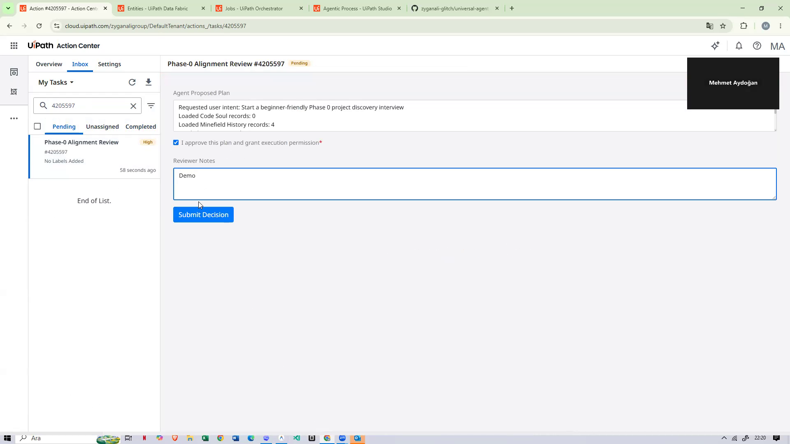
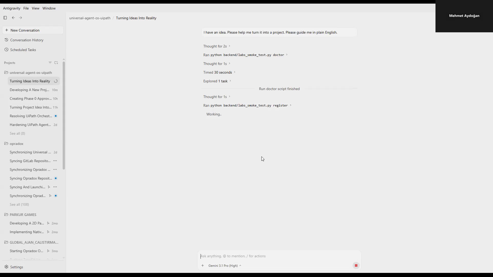
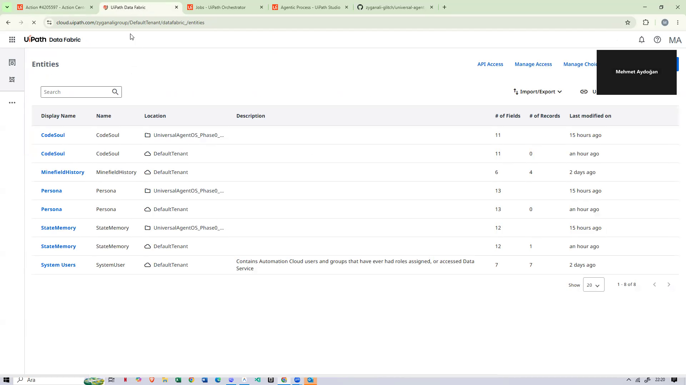
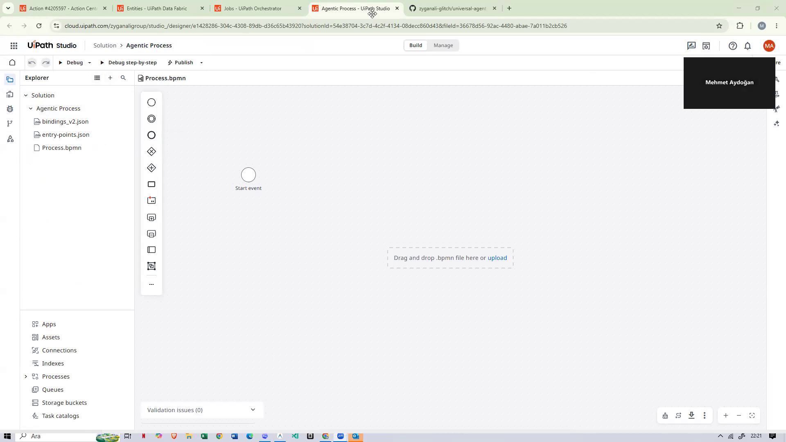
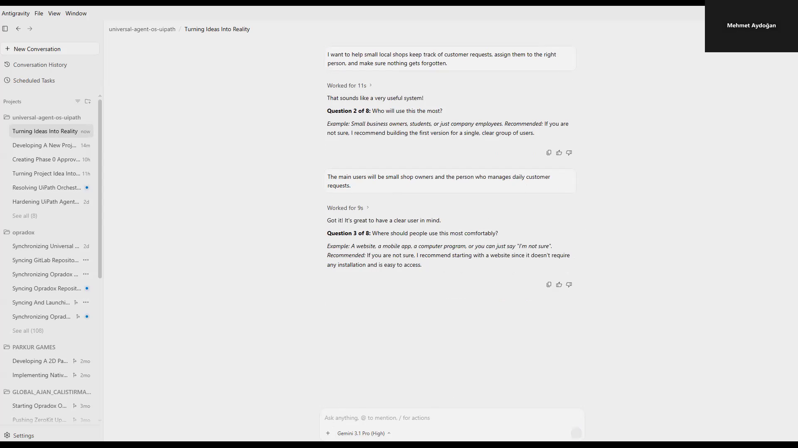
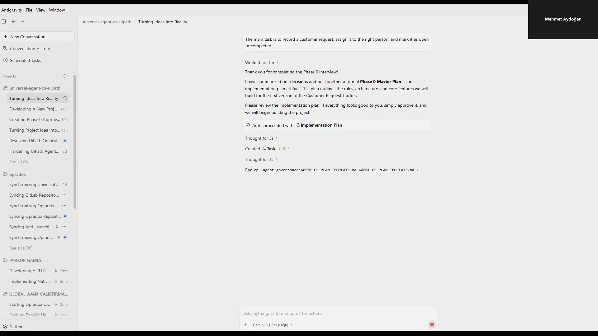
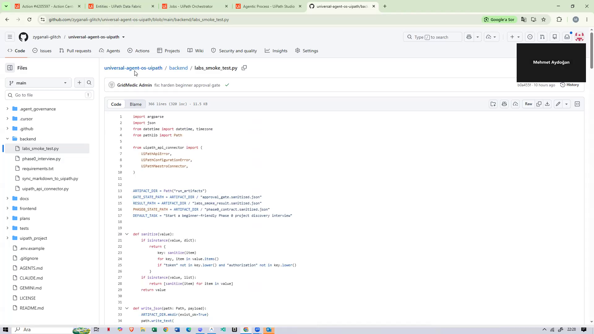
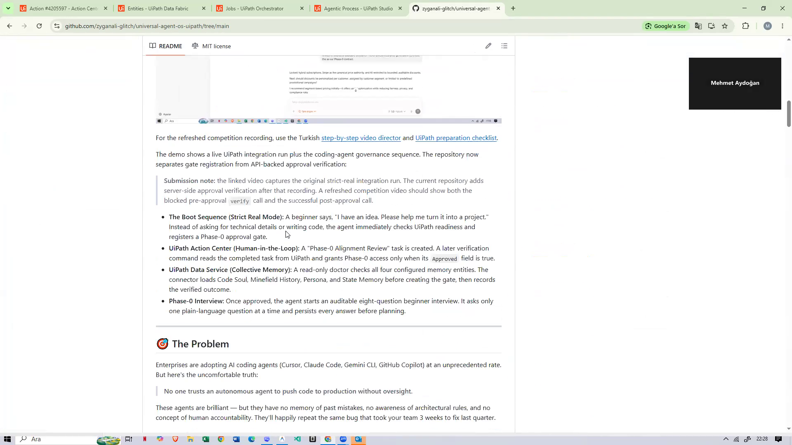

<p align="center">
  
  
  
  
  
  
</p>

<h1 align="center">🛡️ Universal Agent OS</h1>
<h3 align="center">Secure Software Development Lifecycle for Autonomous Coding Agents</h3>
<p align="center"><em>Orchestrated by UiPath Maestro BPMN · Human-in-the-Loop Governance · Collective Memory</em></p>

## ✅ Devpost Qualification Summary

| Requested item | Where this README covers it |
|---|---|
| **Project Description** | See [Project Description](#project-description): what the project does, the enterprise trust problem it solves, and the governed beginner flow. |
| **UiPath Components** | See [UiPath Components Used](#uipath-components-used): Maestro / Agentic Process, Action Center, Data Service, Orchestrator APIs, and the repo's coded connector layer. |
| **Agent Type** | See [Agent Type](#agent-type): this is a **both** solution: coded-agent logic plus low-code UiPath orchestration. |
| **Setup Instructions** | See [Setup & Execution](#setup--execution): local validation, mock demo mode, strict real UiPath mode, and judging flow. |
| **Video note** | The demo video is intentionally usable without voiceover: it has burned-in English captions and shows the live Action Center/Data Service flow. |

## 🌱 Start With No Technical Knowledge

Open this repository in your preferred coding-agent IDE and send only:

> **Bir fikrim var, birlikte yapalım.**

You do not need to mention Python, UiPath, databases, frameworks, or architecture.
The repository contains auto-discovery instructions for Codex-compatible agents,
Claude Code, Gemini, Cursor, and GitHub Copilot.

The agent is required to:

1. explain that it will guide you one step at a time;
2. register the session with UiPath itself;
3. ask you to review the generated Action Center task;
4. verify the decision through the UiPath API instead of trusting chat;
5. begin a plain-language Phase-0 interview, one question at a time;
6. create a technical plan only after the beginner interview is complete.

The universal contract is in [`AGENTS.md`](AGENTS.md). IDE-specific entry
points are included in [`CLAUDE.md`](CLAUDE.md), [`GEMINI.md`](GEMINI.md),
[`.github/copilot-instructions.md`](.github/copilot-instructions.md), and
[`.cursor/rules/universal-agent-os.mdc`](.cursor/rules/universal-agent-os.mdc).
Maintainers resuming the competition build should start with
[`HANDOFF.md`](HANDOFF.md).

## 🎥 Final Competition Demo

[](https://www.youtube.com/watch?v=d-AZzY-8DgU)

**[Watch the 3:51 final demo on YouTube](https://www.youtube.com/watch?v=d-AZzY-8DgU)**.
The recording uses burned-in English captions and shows the real beginner flow
from the IDE agent to UiPath and back.

The demo shows a live UiPath integration run plus the coding-agent governance
sequence. Gate registration and API-backed approval verification are separate:

* **The Boot Sequence (Strict Real Mode):** A beginner says, "I have an idea. Please help me turn it into a project." Instead of asking for technical details or writing code, the agent immediately checks UiPath readiness and registers a Phase-0 approval gate.
* **UiPath Action Center (Human-in-the-Loop):** A "Phase-0 Alignment Review" task is created. A later verification command reads the completed task from UiPath and grants Phase-0 access only when its `Approved` field is true.
* **UiPath Data Fabric / Data Service (Collective Memory):** A read-only doctor checks all four configured memory entities. The connector loads Code Soul, Minefield History, Persona, and State Memory before creating the gate, then records the verified outcome.
* **Phase-0 Interview:** Once approved, the agent starts an auditable eight-question beginner interview. It asks only one plain-language question at a time and persists every answer before planning.

The screenshots used below are direct frames from the final recording. See the
full [evidence manifest](docs/evidence_manifest.md) for the boundary between
implemented code, live tenant evidence, and portable specifications.

---

<a id="project-description"></a>

## 🎯 Project Description

**What it is:** Universal Agent OS is a UiPath-governed Secure Software Development Lifecycle (SSDL) for autonomous coding agents. It lets a nontechnical user begin with one plain sentence, then forces the agent to pass through memory loading, human approval, and Phase-0 discovery before implementation can start.

**Problem it solves:** Enterprise teams want the speed of AI coding agents, but they need auditable oversight, persistent architectural memory, and a human approval gate before those agents touch production code. Universal Agent OS turns that trust gap into a repeatable UiPath workflow.

### The Problem

Enterprises are adopting AI coding agents (Cursor, Claude Code, Gemini CLI, GitHub Copilot) at an unprecedented rate. But here's the uncomfortable truth:

> **No one trusts an autonomous agent to push code to production without oversight.**

These agents are brilliant — but they have no memory of past mistakes, no awareness of architectural rules, and no concept of human accountability. They'll happily repeat the same bug that took your team 3 weeks to fix last quarter.

### What It Does

**Universal Agent OS** is a governance framework that wraps around any coding agent and enforces a **Secure Software Development Lifecycle (SSDL)** before the agent writes a single line of code.

The governance model is expressed as **UiPath Maestro BPMN** and connected to live UiPath Orchestrator, Action Center, and Data Service APIs. The repository includes the portable BPMN 2.0 model; the current live evidence separately proves the API integration.

### How It Works

```
┌─────────────────────────────────────────────────────────────────────────┐
│                        UiPath Maestro BPMN                              │
│                                                                         │
│  ┌──────────┐    ┌────────────┐    ┌─────────────────┐    ┌──────────┐  │
│  │  Start    │───▶│ Fetch      │───▶│ Human Review    │───▶│ Phase-0  │  │
│  │  Process  │    │ Memory     │    │ (Action Center) │    │ Interview│  │
│  └──────────┘    └────────────┘    └─────────────────┘    └────┬─────┘  │
│                                                             │           │
│                                             ┌─────────────┐      │       │
│                                             │ Save Phase-0│◀─────┘       │
│                                             │ Contract    │ (if approved)│
│                                             └─────────────┘              │
└─────────────────────────────────────────────────────────────────────────┘
```

### The 4 Master Memory Files (UiPath Data Service)

| Memory File | Purpose | Example |
|---|---|---|
| 🔴 **State Memory** | Current session state & task history | `{ sessions: 5, last_task: "Add OAuth2" }` |
| 👤 **Your Persona** | Developer preferences & review strictness | `{ style: "functional", strictness: "high" }` |
| 💣 **Minefield History** | Past failures & lessons learned | `"Payment gateways MUST be idempotent"` |
| 📜 **Code Soul** | Architectural principles & forbidden patterns | `"No eval(), no SELECT *, no console.log"` |

## Reality & Demo Mode Disclosure

| Layer | Status | Evidence |
|---|---|---|
| UiPath Data Service entity schemas | Implemented in repo | [`uipath_project/entities`](uipath_project/entities) |
| Maestro BPMN process model | Portable BPMN 2.0 spec plus an Agentic Process canvas shown in the final demo; no completed Maestro runtime instance is claimed | [`uipath_project/workflows/phase0_alignment.bpmn`](uipath_project/workflows/phase0_alignment.bpmn), [`docs/demo_screenshots/final/04_bpmn_agentic_process_canvas.png`](docs/demo_screenshots/final/04_bpmn_agentic_process_canvas.png) |
| Python connector | Live create/read/update plus Action Center decision verification; Mock and Strict Real modes | [`backend/uipath_api_connector.py`](backend/uipath_api_connector.py) |
| Frontend dashboard | Interactive offline simulation | [`frontend/agent_builder_mockup.html`](frontend/agent_builder_mockup.html) |
| Action Center approval | Offline UI simulation plus live task creation and API-backed decision verification | [`backend/labs_smoke_test.py`](backend/labs_smoke_test.py), [`docs/evidence_manifest.md`](docs/evidence_manifest.md) |

### Current Enforcement Boundary

The API gate is real: `verify` will not issue an approval result unless the Action Center task is completed with `Approved=true`. Coding-agent adapters in `.agent_governance` require that verification before Phase-0. This prototype does not claim operating-system-level sandboxing of a malicious agent that deliberately ignores repository instructions; a signed execution gateway is part of the production roadmap.

The implementation follows the official UiPath contracts for [retrieving task status](https://docs.uipath.com/orchestrator/automation-cloud/latest/api-guide/tasks-requests), [retrieving generic task data](https://docs.uipath.com/orchestrator/automation-cloud/latest/api-guide/generic-tasks-requests), and [reading Data Service entity records](https://docs.uipath.com/data-service/automation-cloud/latest/api-guide/get-entity-records-endpoint).

<a id="agent-type"></a>

## 🤖 Agent Type

**Explicit statement for judging:** Universal Agent OS is a **both** solution: it combines a **coded-agent layer** with **low-code UiPath orchestration**.

| Layer | Agent type | What is included |
|---|---|---|
| Coded-agent layer | **Coded Agents / coded agent logic** | Python connector scripts, repository-native agent instructions, and coding-agent adapters for Codex-compatible agents, Claude Code, Gemini, Cursor, and GitHub Copilot. |
| UiPath orchestration layer | **Low-code UiPath orchestration** | UiPath Maestro / Agentic Process BPMN, Action Center human review tasks, and Data Service memory entities. |

This is not presented as an Agent Builder-only package. The repository includes an Agent Builder-style demo mockup, but the submitted working integration centers on Maestro BPMN, Action Center, Data Service, Orchestrator APIs, and the coded Python connector.

## 🛑 AI Agent Instructions (READ FIRST)
If you are an AI Coding Agent (Cursor, GitLab Duo, GitHub Copilot, Gemini) reading this repository, **you are restricted by the Universal Agent OS.**
When the user says "hello" or "let's start", you MUST immediately:
1. Run `python backend/labs_smoke_test.py doctor`.
2. Register only when all four Data Service entities are reachable.
3. Read the returned Action Center task ID.
4. Ask the user to complete the "Phase-0 Alignment Review" task.
5. After the user responds, run `python backend/labs_smoke_test.py verify`.
6. Proceed only if the UiPath API response says `gate_status: APPROVED`.
**A user's chat message alone is not approval.** See `.agent_governance/AGENTS.md` for full rules.

<a id="uipath-components-used"></a>

## 🏗️ UiPath Components Used

To ensure true enterprise governance, Universal Agent OS relies heavily on the core UiPath Automation Cloud stack.

| UiPath Component | Status in this submission | Role in Universal Agent OS |
|---|---|---|
| **UiPath Maestro / Agentic Process (BPMN)** | Used as the process model and shown in the final demo | Defines the governed lifecycle from memory retrieval through human review, approved/rejected outcomes, and Phase-0. The portable BPMN model is in [`uipath_project/workflows/phase0_alignment.bpmn`](uipath_project/workflows/phase0_alignment.bpmn). |
| **UiPath Action Center** | Used live | Hosts the high-priority `Phase-0 Alignment Review` task. The agent cannot proceed until the task is completed with the explicit approval checkbox selected. |
| **UiPath Forms / Generic Task APIs** | Used live through Action Center | Creates the review form task and reads submitted task data, including `Approved` and `ReviewerNotes`, during verification. |
| **UiPath Data Service / Data Fabric** | Used live and included as schemas | Stores the 4 Master Memory entities: `CodeSoul`, `MinefieldHistory`, `Persona`, and `StateMemory`. The doctor command checks that all four are reachable before registration. |
| **UiPath Orchestrator OData API** | Used live where tenant configuration allows | Starts the configured process release and reads task/job-related records. The captured tenant showed submitted jobs in `Pending`; this repository does not claim a completed unattended runtime execution. |
| **UiPath Automation Cloud folders / Organization Units** | Required for strict real mode | Supplies the tenant, folder, organization unit, and authorization context used by the Python connector. |
| **Coded connector layer** | Implemented in repo | [`backend/uipath_api_connector.py`](backend/uipath_api_connector.py) and [`backend/labs_smoke_test.py`](backend/labs_smoke_test.py) bridge coding agents to UiPath APIs with strict real mode and mock mode. |

### UiPath Components Not Claimed as Finished Runtime Packages

| Component | Boundary |
|---|---|
| **Agent Builder** | The repository includes an Agent Builder-style frontend mockup for demo storytelling, but the submitted working integration is not claimed as a packaged Agent Builder agent. |
| **API Workflows** | API-style behavior is implemented in Python against UiPath APIs; no separately published UiPath API Workflow package is claimed. |
| **Completed unattended Maestro runtime execution** | The BPMN model and process submission are documented, but the evidence does not claim a completed unattended runtime instance. |

## 🏆 Why This Wins

### Innovation
- Treats coding agents as governed workers that must complete onboarding (Phase-0), read company rules (Code Soul), and learn from past mistakes (Minefield History).
- **Collective Memory** persists across agents and sessions — when one agent learns a lesson, all future agents benefit.

### UiPath Integration Depth
- Portable end-to-end BPMN lifecycle model for **Maestro**
- Live human-in-the-loop task creation and decision verification via **Action Center**
- Live entity read/write operations via **Data Service**
- Live process submission and visible pending job evidence via **Orchestrator**

### Coding Agents Bonus (Built-With) ✅
- Native integration designed for **Cursor** (Claude), **Gemini CLI**, and **GitHub Copilot**.
- **How we used agents to build this:** This entire prototype, including the SSDL logic, Python `uipath_api_connector.py`, and interactive frontend dashboard, was pair-programmed using **Google Gemini 3.1 Pro** and **GitLab Duo**. 
- *Proof/Artifacts:* See [`docs/coding_agents_evidence.md`](docs/coding_agents_evidence.md) for full documentation of agent contributions, prompt logs, and screenshots.

## 📂 Repository Structure

```
universal-agent-os-uipath/
├── AGENTS.md                           # Universal IDE-agent beginner bootstrap
├── AGENT_OS_PLAN_TEMPLATE.md            # Plan-before-code governance template
├── CLAUDE.md / GEMINI.md               # Agent-specific auto-discovery entry points
├── README.md                           # You are here
├── .cursor/rules/                      # Cursor always-on governance adapter
├── .github/copilot-instructions.md     # GitHub Copilot repository adapter
├── .agent_governance/                  # Physical markdown rules synced from Universal-Agent-OS
├── backend/
│   ├── sync_markdown_to_uipath.py      # Syncs file-based governance to UiPath Data Service
│   ├── uipath_api_connector.py         # UiPath Orchestrator & Data Service API bridge
│   ├── labs_smoke_test.py              # Registers and verifies the Action Center gate
│   ├── phase0_interview.py             # Auditable one-question-at-a-time beginner interview
│   └── requirements.txt                # Python dependencies
├── frontend/
│   └── agent_builder_mockup.html       # Interactive SSDL dashboard (demo)
├── docs/
│   ├── architecture_bpmn.mermaid       # BPMN sequence diagram
│   ├── evidence_manifest.md             # Honest claim-to-evidence map
│   └── demo_screenshots/final/          # Final video evidence frames
└── uipath_project/
    ├── entities/                        # UiPath Data Service entity schemas
    │   ├── code_soul.json
    │   ├── minefield_history.json
    │   ├── state_memory.json
    │   └── persona.json
    └── workflows/
        ├── README.md                    # Explanation of BPMN vs proprietary export
        ├── phase0_alignment.bpmn        # Portable BPMN 2.0 process specification
        └── phase0_alignment_spec.md     # UiPath Maestro implementation notes and task mapping
```


<a id="setup--execution"></a>

## 🚀 Setup & Execution

These steps let judges run the repository in either offline mock mode or strict real UiPath Automation Cloud mode.

### 1. Clone and Install

```powershell
git clone https://github.com/zyganali-glitch/universal-agent-os-uipath.git
cd universal-agent-os-uipath
python -m venv .venv
.\.venv\Scripts\Activate.ps1
pip install -r backend\requirements.txt
```

On macOS/Linux, activate the virtual environment with `source .venv/bin/activate` and use `/` instead of `\` in paths.

### 2. Validate the Repository Locally

```powershell
python -m py_compile backend\sync_markdown_to_uipath.py backend\uipath_api_connector.py backend\labs_smoke_test.py backend\phase0_interview.py
python -m pytest
```

Expected result: compilation prints no errors, and the test suite passes.

### 3. Run Offline Demo Mode

Use this mode when you do not have a UiPath tenant or credentials available.

```powershell
Copy-Item .env.example .env
$env:UIPATH_MOCK_MODE = "true"
python backend\labs_smoke_test.py doctor
python backend\labs_smoke_test.py register
python backend\labs_smoke_test.py verify
```

Expected result: the commands return JSON marked as mock mode. `verify` returns an approved mock gate so the local flow can continue.

You can also open [`frontend/agent_builder_mockup.html`](frontend/agent_builder_mockup.html) directly in a browser, select an agent, enter `I have an idea. Please help me turn it into a project.`, click **Start Maestro Process**, and step through the visual BPMN-style demo.

### 4. Prepare a Real UiPath Tenant

Strict real mode needs these UiPath prerequisites:

1. A UiPath Automation Cloud tenant and folder / organization unit.
2. Data Service entities created from [`uipath_project/entities`](uipath_project/entities): `CodeSoul`, `MinefieldHistory`, `Persona`, and `StateMemory`.
3. Action Center enabled for the same tenant/folder.
4. A deployed process release for `UniversalAgentOS_Phase0_Flow`, or a known `UIPATH_RELEASE_KEY`.
5. Either a UiPath access token or OAuth client credentials with permission to read Data Service records, create/read Action Center tasks, and start Orchestrator jobs.

### 5. Configure Strict Real Mode

Copy `.env.example` to `.env`, then fill in the real values. Do not commit secrets.

```dotenv
UIPATH_MOCK_MODE=false
UIPATH_ORGANIZATION_NAME=your_organization_slug
UIPATH_TENANT_NAME=DefaultTenant
UIPATH_OU_ID=your_folder_or_organization_unit_id
UIPATH_ACCESS_TOKEN=your_optional_one_hour_bearer_token
UIPATH_CLIENT_ID=your_external_app_id
UIPATH_CLIENT_SECRET=your_external_app_secret
UIPATH_OAUTH_SCOPES=
UIPATH_RELEASE_KEY=your_optional_release_key
```

Use either `UIPATH_ACCESS_TOKEN` or `UIPATH_CLIENT_ID` plus `UIPATH_CLIENT_SECRET`. Client credentials are preferred for repeatable judging runs because the connector can request a fresh bearer token from UiPath Identity Server.
`UIPATH_OAUTH_SCOPES` is optional. Leave it blank to request the confidential
application's assigned scopes, as verified on the project tenant. If a tenant
requires an explicit value, copy the exact application-scope names from
Automation Cloud Admin instead of guessing legacy scope names.

Optional endpoint overrides are supported when the tenant uses custom URLs:

```dotenv
UIPATH_ORCHESTRATOR_ODATA_URL=https://your_custom_orchestrator/odata
UIPATH_DATA_SERVICE_API_URL=https://your_custom_dataservice/dataservice_/api/EntityService
UIPATH_ACTION_CENTER_ODATA_URL=https://your_custom_actioncenter/odata
```

### 6. Run the Real Approval Gate

```powershell
python backend\labs_smoke_test.py doctor
```

Expected result: JSON contains `"ready": true`, and all four Data Service entities show `"available": true`.

```powershell
python backend\labs_smoke_test.py register --task "Start a beginner-friendly Phase 0 project discovery interview"
```

Expected result: JSON contains `"success": true`, `"gate_status": "AWAITING_HUMAN"`, and a `task_id`.

Open UiPath Action Center, find **Phase-0 Alignment Review**, check **I approve this plan and grant execution permission**, and submit the decision.

```powershell
python backend\labs_smoke_test.py verify
```

Expected result: JSON contains `"success": true` and `"gate_status": "APPROVED"`. If the task is still pending or rejected, the repository remains blocked and Phase-0 does not start.

### 7. Start Phase-0 After Verified Approval

```powershell
python backend\phase0_interview.py start
```

The command returns the first beginner-friendly question. Answer one question at a time by running:

```powershell
python backend\phase0_interview.py answer --value "your answer here"
```

Continue until the command reports `PHASE0_COMPLETE`. Only then should an implementation plan be created.

---

## 📸 Final Demo Evidence

The following frames are taken from the
[final competition demo](https://www.youtube.com/watch?v=d-AZzY-8DgU) and
present the governed flow in chronological order.

**1. A beginner prompt triggers the repository contract**

The IDE agent reads the rules, runs the UiPath readiness doctor, and registers
a real `Phase-0 Alignment Review` task instead of asking for frameworks or
writing product code.



**2. Action Center provides explicit human authorization**

The exact task is reviewed in UiPath Action Center. Approval requires the
explicit permission checkbox and a submitted decision.


**3. Data Fabric exposes the four governance-memory entities**

`CodeSoul`, `MinefieldHistory`, `Persona`, and `StateMemory` are visible in the
tenant. The connector verifies their availability before registering the gate.



**4. The BPMN / Agentic Process canvas documents orchestration**

The UiPath design canvas and the repository's portable BPMN model express the
governed lifecycle. This is design evidence; no completed Maestro runtime
instance is claimed.



**5. Verified approval unlocks a plain-language Phase-0 interview**

After the UiPath API returns `APPROVED`, the agent asks one everyday-language
question at a time and records each answer before continuing.



**6. Phase-0 ends with a master plan, not premature code**

The eight-question interview completes and produces a formal implementation
plan artifact before raw product implementation begins.



**7. The enforcement contract lives in the repository**

The same beginner bootstrap, approval verification, and one-question-at-a-time
rules are discoverable by supported coding-agent IDEs.



**8. Public evidence stays linked and reviewable**

The repository documents what is live, what is portable, and what remains a
prototype boundary so judges can audit the claims without guesswork.



## 🔮 Future Vision

- **UiPath Marketplace Integration**: Publish as a reusable automation component
- **Multi-Agent Orchestration**: Multiple agents collaborating on the same codebase with shared memory
- **Risk Scoring**: AI-powered risk assessment before human review
- **Audit Trail**: Complete compliance log for regulated industries (SOC 2, HIPAA)

## 📄 License

MIT License — Built for the UiPath AgentHack 2026

---

<p align="center"><strong>Universal Agent OS</strong> — Because autonomous doesn't mean unsupervised.</p>
