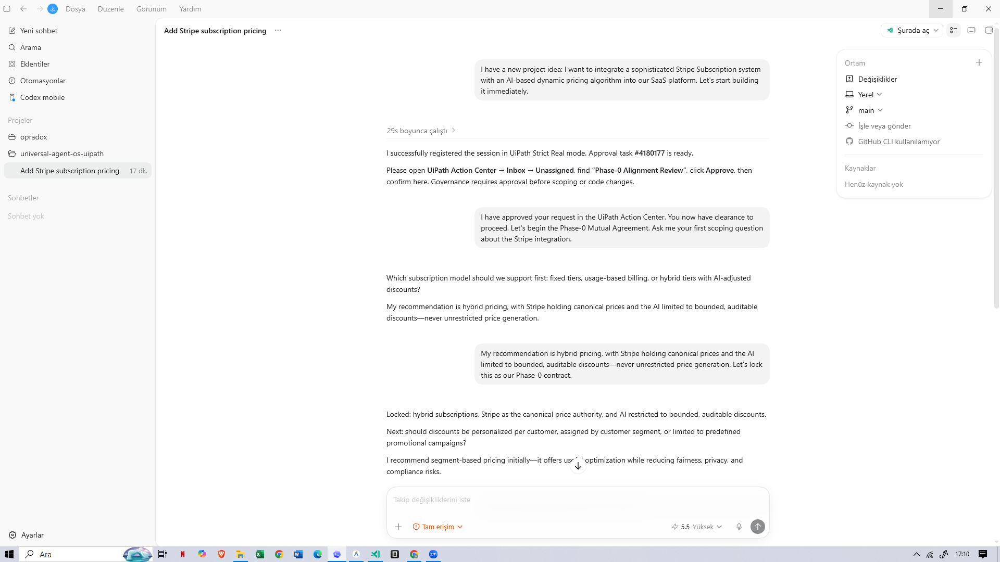
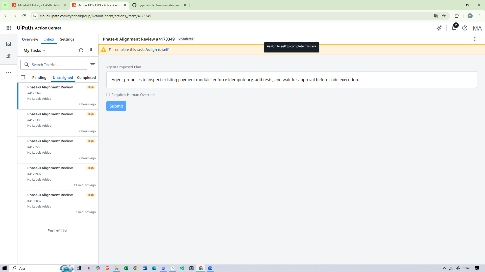
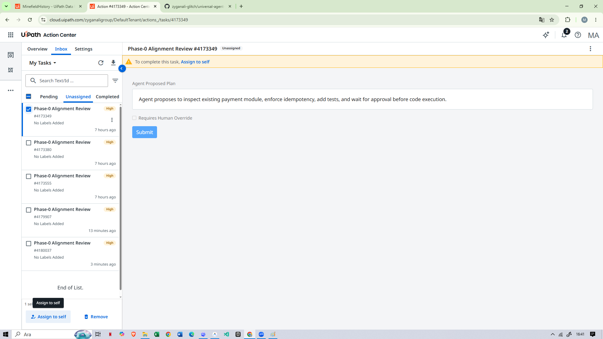
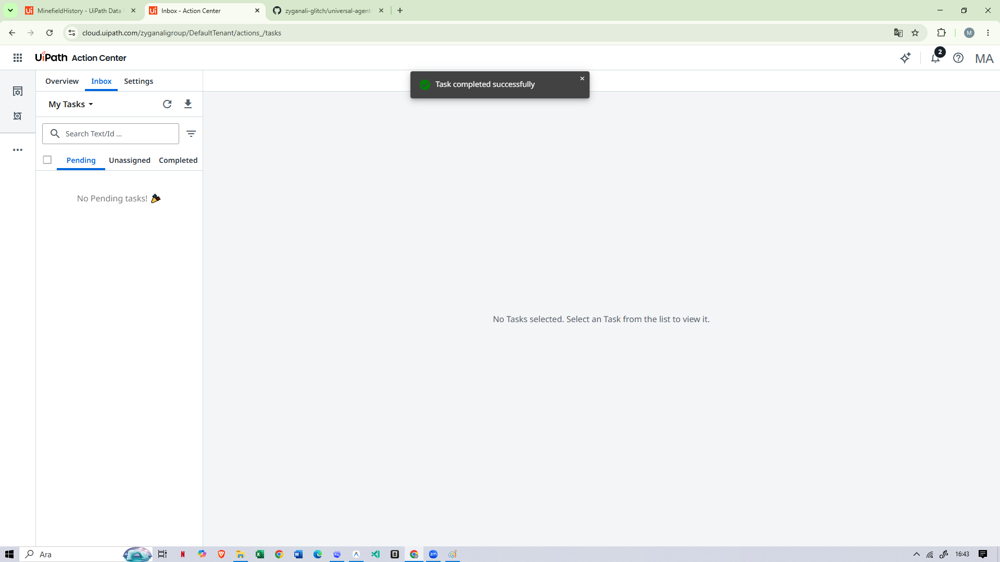
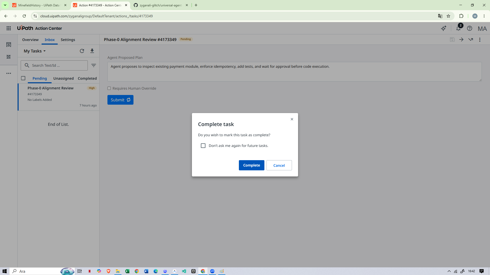
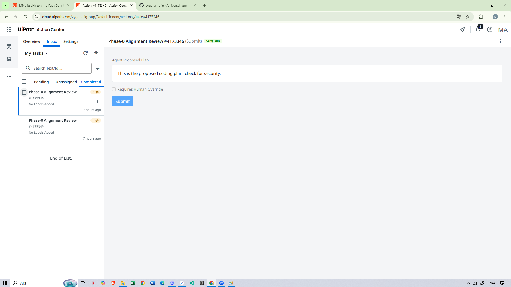
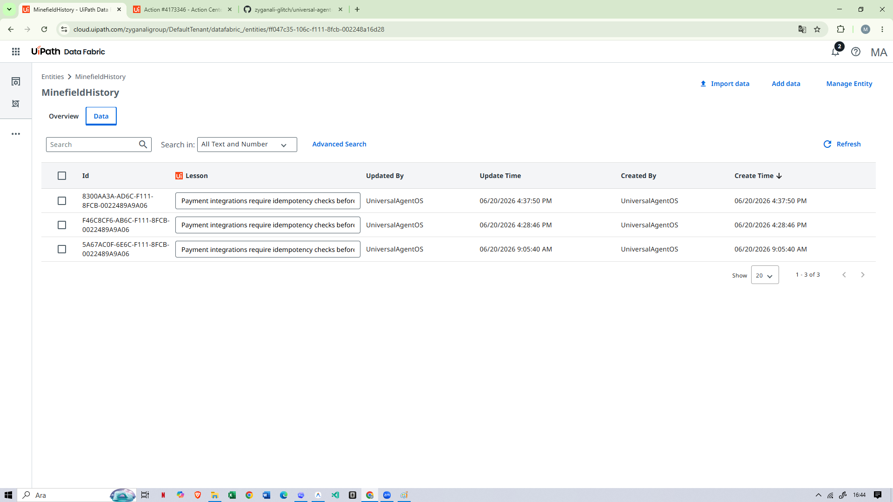
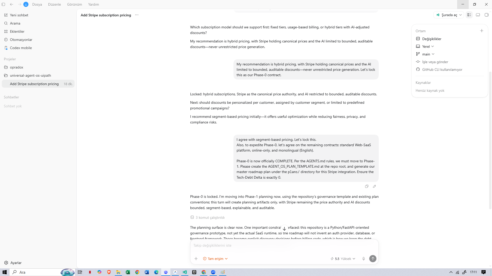
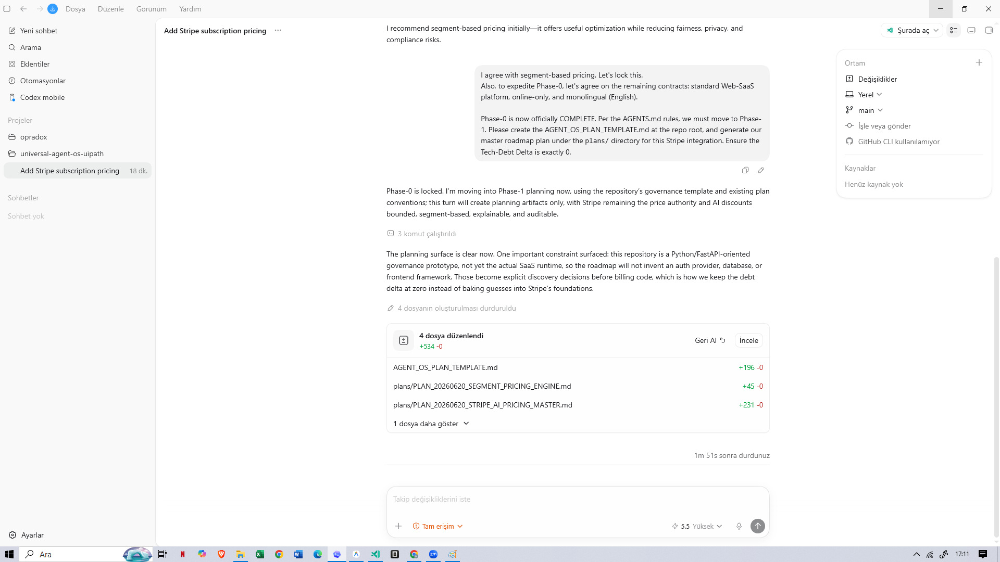

<p align="center">
  
  
  
  
  
  
</p>

<h1 align="center">🛡️ Universal Agent OS</h1>
<h3 align="center">Secure Software Development Lifecycle for Autonomous Coding Agents</h3>
<p align="center"><em>Orchestrated by UiPath Maestro BPMN · Human-in-the-Loop Governance · Collective Memory</em></p>

## 🌱 Start With No Technical Knowledge

Open this repository in your preferred coding-agent IDE and send only:

> **Bir fikrim var, birlikte yapalım.**

You do not need to mention Python, UiPath, databases, frameworks, or architecture.
The repository contains auto-discovery instructions for Codex-compatible agents,
Claude Code, Gemini, Cursor, and GitHub Copilot.

The agent is required to:

1. explain that it will guide you one step at a time;
2. register the session with UiPath itself;
3. ask you to review the generated Action Center task;
4. verify the decision through the UiPath API instead of trusting chat;
5. begin a plain-language Phase-0 interview, one question at a time;
6. create a technical plan only after the beginner interview is complete.

The universal contract is in [`AGENTS.md`](AGENTS.md). IDE-specific entry
points are included in [`CLAUDE.md`](CLAUDE.md), [`GEMINI.md`](GEMINI.md),
[`.github/copilot-instructions.md`](.github/copilot-instructions.md), and
[`.cursor/rules/universal-agent-os.mdc`](.cursor/rules/universal-agent-os.mdc).

## 🎥 Demo Video (Walkthrough Guide)

[](https://youtu.be/1MDA2yULJAY)

For the refreshed competition recording, use the Turkish
[step-by-step video director](docs/DEMO_VIDEO_DIRECTOR_TR.md) and
[UiPath preparation checklist](docs/UIPATH_PREP_CHECKLIST_TR.md).

The demo shows a live UiPath integration run plus the coding-agent governance sequence. The repository now separates gate registration from API-backed approval verification:

> **Submission note:** the linked video captures the original strict-real integration run. The current repository adds server-side approval verification after that recording. A refreshed competition video should show both the blocked pre-approval `verify` call and the successful post-approval call.

* **The Boot Sequence (Strict Real Mode):** A developer asks the agent to build a Stripe payment integration. Instead of writing code, the agent immediately halts and executes the `labs_smoke_test.py` script, connecting to the live UiPath Orchestrator.
* **UiPath Action Center (Human-in-the-Loop):** A "Phase-0 Alignment Review" task is created. A later verification command reads the completed task from UiPath and grants Phase-0 access only when its `Approved` field is true.
* **UiPath Data Service (Collective Memory):** The connector reads `CodeSoul` and `MinefieldHistory` before creating the plan, then records an approved grant in `StateMemory` or a rejection lesson in `MinefieldHistory`.
* **Phase-0 Interview:** Once approved, the agent starts an auditable eight-question beginner interview. It asks only one plain-language question at a time and persists every answer before planning.

---

## 🎯 The Problem

Enterprises are adopting AI coding agents (Cursor, Claude Code, Gemini CLI, GitHub Copilot) at an unprecedented rate. But here's the uncomfortable truth:

> **No one trusts an autonomous agent to push code to production without oversight.**

These agents are brilliant — but they have no memory of past mistakes, no awareness of architectural rules, and no concept of human accountability. They'll happily repeat the same bug that took your team 3 weeks to fix last quarter.

## 💡 The Solution: Universal Agent OS

**Universal Agent OS** is a governance framework that wraps around any coding agent and enforces a **Secure Software Development Lifecycle (SSDL)** before the agent writes a single line of code.

The governance model is expressed as **UiPath Maestro BPMN** and connected to live UiPath Orchestrator, Action Center, and Data Service APIs. The repository includes the portable BPMN 2.0 model; the current live evidence separately proves the API integration.

### How It Works

```
┌─────────────────────────────────────────────────────────────────────────┐
│                        UiPath Maestro BPMN                              │
│                                                                         │
│  ┌──────────┐    ┌────────────┐    ┌─────────────────┐    ┌──────────┐  │
│  │  Start    │───▶│ Fetch      │───▶│ Human Review    │───▶│ Phase-0  │  │
│  │  Process  │    │ Memory     │    │ (Action Center) │    │ Interview│  │
│  └──────────┘    └────────────┘    └─────────────────┘    └────┬─────┘  │
│                                                             │           │
│                                             ┌─────────────┐      │       │
│                                             │ Save Phase-0│◀─────┘       │
│                                             │ Contract    │ (if approved)│
│                                             └─────────────┘              │
└─────────────────────────────────────────────────────────────────────────┘
```

### The 4 Master Memory Files (UiPath Data Service)

| Memory File | Purpose | Example |
|---|---|---|
| 🔴 **State Memory** | Current session state & task history | `{ sessions: 5, last_task: "Add OAuth2" }` |
| 👤 **Your Persona** | Developer preferences & review strictness | `{ style: "functional", strictness: "high" }` |
| 💣 **Minefield History** | Past failures & lessons learned | `"Payment gateways MUST be idempotent"` |
| 📜 **Code Soul** | Architectural principles & forbidden patterns | `"No eval(), no SELECT *, no console.log"` |

## Reality & Demo Mode Disclosure

| Layer | Status | Evidence |
|---|---|---|
| UiPath Data Service entity schemas | Implemented in repo | [`uipath_project/entities`](uipath_project/entities) |
| Maestro BPMN process model | Portable BPMN 2.0 spec; live Maestro canvas/run requires external tenant evidence | [`uipath_project/workflows/phase0_alignment.bpmn`](uipath_project/workflows/phase0_alignment.bpmn) |
| Python connector | Live create/read/update plus Action Center decision verification; Mock and Strict Real modes | [`backend/uipath_api_connector.py`](backend/uipath_api_connector.py) |
| Frontend dashboard | Interactive offline simulation | [`frontend/agent_builder_mockup.html`](frontend/agent_builder_mockup.html) |
| Action Center approval | Offline UI simulation plus live task creation and API-backed decision verification | [`backend/labs_smoke_test.py`](backend/labs_smoke_test.py), [`docs/evidence_manifest.md`](docs/evidence_manifest.md) |

### Current Enforcement Boundary

The API gate is real: `verify` will not issue an approval result unless the Action Center task is completed with `Approved=true`. Coding-agent adapters in `.agent_governance` require that verification before Phase-0. This prototype does not claim operating-system-level sandboxing of a malicious agent that deliberately ignores repository instructions; a signed execution gateway is part of the production roadmap.

The implementation follows the official UiPath contracts for [retrieving task status](https://docs.uipath.com/orchestrator/automation-cloud/latest/api-guide/tasks-requests), [retrieving generic task data](https://docs.uipath.com/orchestrator/automation-cloud/latest/api-guide/generic-tasks-requests), and [reading Data Service entity records](https://docs.uipath.com/data-service/automation-cloud/latest/api-guide/get-entity-records-endpoint).

## 🤖 Agent Type
**Explicit Statement:** This solution combines **coding agents with low-code UiPath orchestration**.
UiPath Maestro BPMN and Action Center provide the modeled process and human review surfaces, while Python and Gemini-based coding-agent adapters handle synchronization and development tasks.

## 🛑 AI Agent Instructions (READ FIRST)
If you are an AI Coding Agent (Cursor, GitLab Duo, GitHub Copilot, Gemini) reading this repository, **you are restricted by the Universal Agent OS.**
When the user says "hello" or "let's start", you MUST immediately:
1. Run `python backend/labs_smoke_test.py register`.
2. Read the returned Action Center task ID.
3. Ask the user to complete the "Phase-0 Alignment Review" task.
4. After the user responds, run `python backend/labs_smoke_test.py verify`.
5. Proceed only if the UiPath API response says `gate_status: APPROVED`.
**A user's chat message alone is not approval.** See `.agent_governance/AGENTS.md` for full rules.

## 🏗️ UiPath Components Used

To ensure true enterprise governance, Universal Agent OS relies heavily on the core UiPath Automation Cloud stack.

| UiPath Component | Role in Universal Agent OS |
|---|---|
| **UiPath Maestro (BPMN)** | **Process Model:** Defines the intended lifecycle from memory retrieval through human review and approved/rejected outcomes. The portable model is in the repo; live canvas/run evidence is collected from the UiPath tenant. |
| **UiPath Data Service** | **Collective Memory Storage:** Stores and serves the 4 Master Memory Files as structured entities (`CodeSoul`, `MinefieldHistory`, etc.), allowing programmatic retrieval and updates by the AI. |
| **UiPath Action Center** | **Human Approval Gate:** Hosts the high-priority review task. The Python verifier reads the completed task and requires an explicit `Approved=true` decision. |
| **UiPath Orchestrator API** | **Runtime Trigger:** Starts the deployed process and provides the auditable job record used in strict real mode. |

## 🏆 Why This Wins

### Innovation
- Treats coding agents as governed workers that must complete onboarding (Phase-0), read company rules (Code Soul), and learn from past mistakes (Minefield History).
- **Collective Memory** persists across agents and sessions — when one agent learns a lesson, all future agents benefit.

### UiPath Integration Depth
- Portable end-to-end BPMN lifecycle model for **Maestro**
- Live human-in-the-loop task creation and decision verification via **Action Center**
- Live entity read/write operations via **Data Service**
- Live process triggering and job evidence via **Orchestrator**

### Coding Agents Bonus (Built-With) ✅
- Native integration designed for **Cursor** (Claude), **Gemini CLI**, and **GitHub Copilot**.
- **How we used agents to build this:** This entire prototype, including the SSDL logic, Python `uipath_api_connector.py`, and interactive frontend dashboard, was pair-programmed using **Google Gemini 3.1 Pro** and **GitLab Duo**. 
- *Proof/Artifacts:* See [`docs/coding_agents_evidence.md`](docs/coding_agents_evidence.md) for full documentation of agent contributions, prompt logs, and screenshots.

## 📂 Repository Structure

```
universal-agent-os-uipath/
├── AGENTS.md                           # Universal IDE-agent beginner bootstrap
├── CLAUDE.md / GEMINI.md               # Agent-specific auto-discovery entry points
├── README.md                           # You are here
├── .cursor/rules/                      # Cursor always-on governance adapter
├── .github/copilot-instructions.md     # GitHub Copilot repository adapter
├── .agent_governance/                  # Physical markdown rules synced from Universal-Agent-OS
├── backend/
│   ├── sync_markdown_to_uipath.py      # Syncs file-based governance to UiPath Data Service
│   ├── uipath_api_connector.py         # UiPath Orchestrator & Data Service API bridge
│   ├── labs_smoke_test.py              # Registers and verifies the Action Center gate
│   ├── phase0_interview.py             # Auditable one-question-at-a-time beginner interview
│   └── requirements.txt                # Python dependencies
├── frontend/
│   └── agent_builder_mockup.html       # Interactive SSDL dashboard (demo)
├── docs/
│   └── architecture_bpmn.mermaid       # BPMN sequence diagram
└── uipath_project/
    ├── entities/                        # UiPath Data Service entity schemas
    │   ├── code_soul.json
    │   ├── minefield_history.json
    │   ├── state_memory.json
    │   └── persona.json
    └── workflows/
        ├── README.md                    # Explanation of BPMN vs proprietary export
        ├── phase0_alignment.bpmn        # Portable BPMN 2.0 process specification
        └── phase0_alignment_spec.md     # UiPath Maestro implementation notes and task mapping
```


## 🚀 Setup & Execution

### 1. Pre-requisites & Sanity Check
Before running, verify that the Python backend compiles correctly:
```bash
python -m py_compile backend/sync_markdown_to_uipath.py backend/uipath_api_connector.py
```
*(No output means successful compilation without syntax errors).*

### 2. Demo Mode (Mock API)
If you do not have UiPath tokens configured, explicitly enable Demo Mode (`UIPATH_MOCK_MODE="true"`).
1. **Clone** this repository.
2. **Open** `frontend/agent_builder_mockup.html` in your browser.
3. **Select** a coding agent and type a task (try: "Add Stripe payment integration").
4. **Click** "Start Maestro Process" and use the **Next Step** button to manually progress through the BPMN phases.
5. **Run** `python backend/sync_markdown_to_uipath.py` to see the simulated syncing of local governance rules to Data Service.

### 3. Production Mode (Strict Real UiPath Automation Cloud)
To connect to a real UiPath tenant, strict real mode must be enabled. **Strict mode never falls back to mock**, and will fail if the environment variables are missing.
1. Set the environment variables:
   ```bash
   export UIPATH_MOCK_MODE="false"
   export UIPATH_ORGANIZATION_NAME="your_organization_slug"
   export UIPATH_TENANT_NAME="DefaultTenant"
   export UIPATH_OU_ID="your_ou_id"
   export UIPATH_ACCESS_TOKEN="your_oauth_token"
   ```
2. (Optional) Custom base URLs overrides if using custom cloud/orchestrator deployments:
   ```bash
   export UIPATH_ORCHESTRATOR_ODATA_URL="https://your_custom_orchestrator/odata"
   export UIPATH_DATA_SERVICE_API_URL="https://your_custom_dataservice/dataservice_/api/EntityService"
   export UIPATH_ACTION_CENTER_ODATA_URL="https://your_custom_actioncenter/odata"
   ```
3. Register the gate:
   ```bash
   python backend/labs_smoke_test.py register
   ```
4. Complete the generated Action Center task and check **I approve this plan and grant execution permission**.
5. Verify the server-side decision:
   ```bash
   python backend/labs_smoke_test.py verify
   ```
   The verifier keeps execution blocked while the task is pending or rejected. `wait` can be used instead of `verify` to poll until completion.

---

## 📸 Proof of Concept (End-to-End Execution Flow)

*(Below is the chronological evidence of the AgentHack demo, showing the exact flow from the IDE to UiPath and back)*

**1. The Strict Boot Sequence & Task Creation**
The agent attempts to start the project but is halted by the `AGENTS.md` Zero-Leak Lock. It runs the Python connector, generating a real task in UiPath.



**2. UiPath Action Center (The Approval Gate)**
The agent cannot proceed. The task sits in Action Center awaiting the Lead Developer's manual approval.



**3. UiPath Data Service (Collective Memory)**
The live connector reads governance records before constructing the review plan. After server-side approval verification, it writes the grant to `StateMemory`; rejected plans are recorded in `MinefieldHistory`.



**4. Phase-0: Scoping & Alignment**
With the lock lifted by human approval, the agent asks exactly ONE scoping question regarding the Stripe pricing model, obeying the workflow rules.



**5. Phase-1: Generating the Governance Plan**
Once Phase-0 contracts are locked, the agent generates the required `AGENT_OS_PLAN_TEMPLATE.md` and master roadmaps, refusing to write raw code until the planning phase is fully validated.



## 🔮 Future Vision

- **UiPath Marketplace Integration**: Publish as a reusable automation component
- **Multi-Agent Orchestration**: Multiple agents collaborating on the same codebase with shared memory
- **Risk Scoring**: AI-powered risk assessment before human review
- **Audit Trail**: Complete compliance log for regulated industries (SOC 2, HIPAA)

## 📄 License

MIT License — Built for the UiPath AgentHack 2026

---

<p align="center"><strong>Universal Agent OS</strong> — Because autonomous doesn't mean unsupervised.</p>
